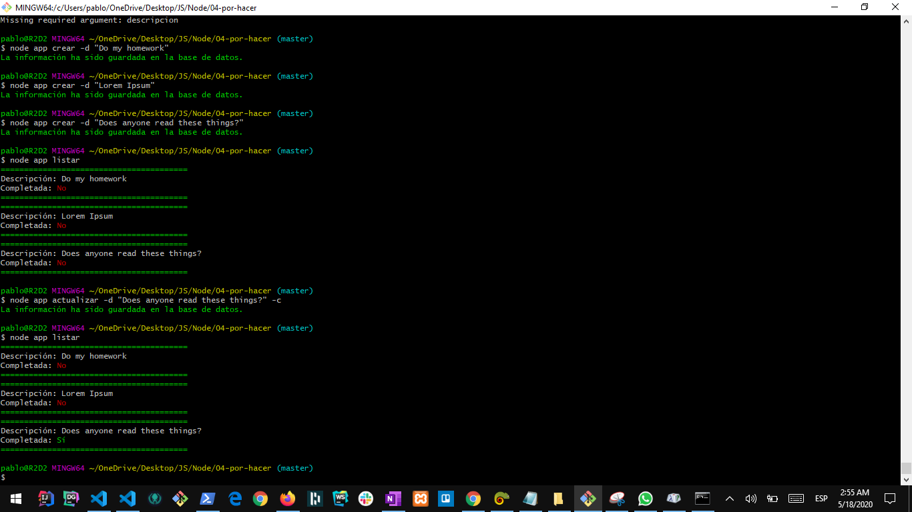

## To-Do NodeJS App

### Descripción

Esta aplicación fue diseñada para administrar un conjunto de tareas por hacer. 

### Visualización 



### Configuración

Para instalar esta aplicación escriba el comando: 

```
    npm install 
```

Con este comando se instalarán todas las dependencias necesarias para ejecutar la aplicación. 


## Datos del Autor 

1. Nombre Completo: Pablo Fonseca
2. Correo Electrónico: pablo.fonsecam@outlook.com
3. Sitio Web Profesional: <pablofonseca-dev.github.io/professional-website>


